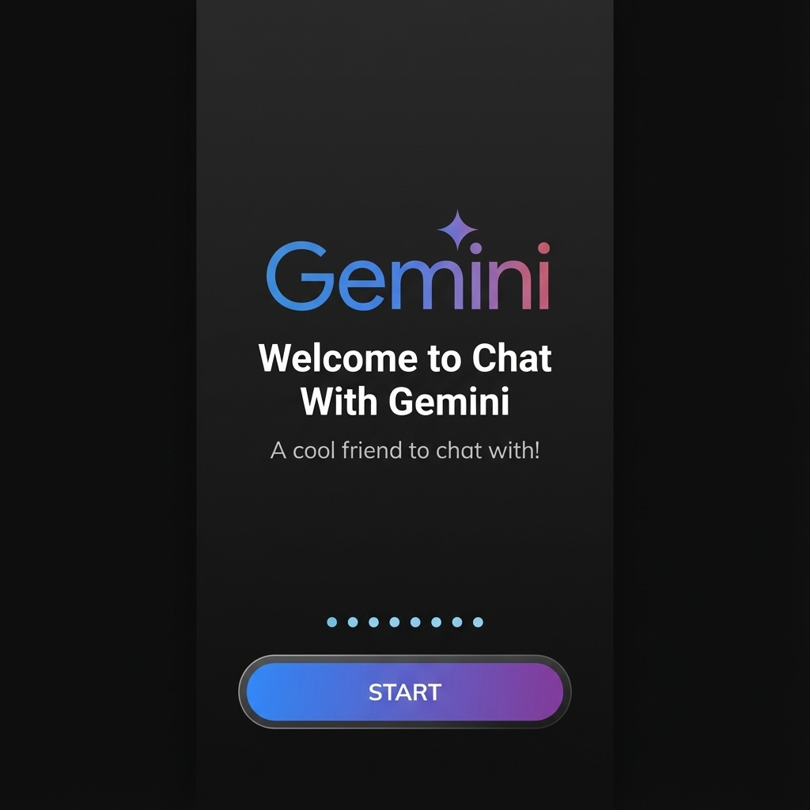
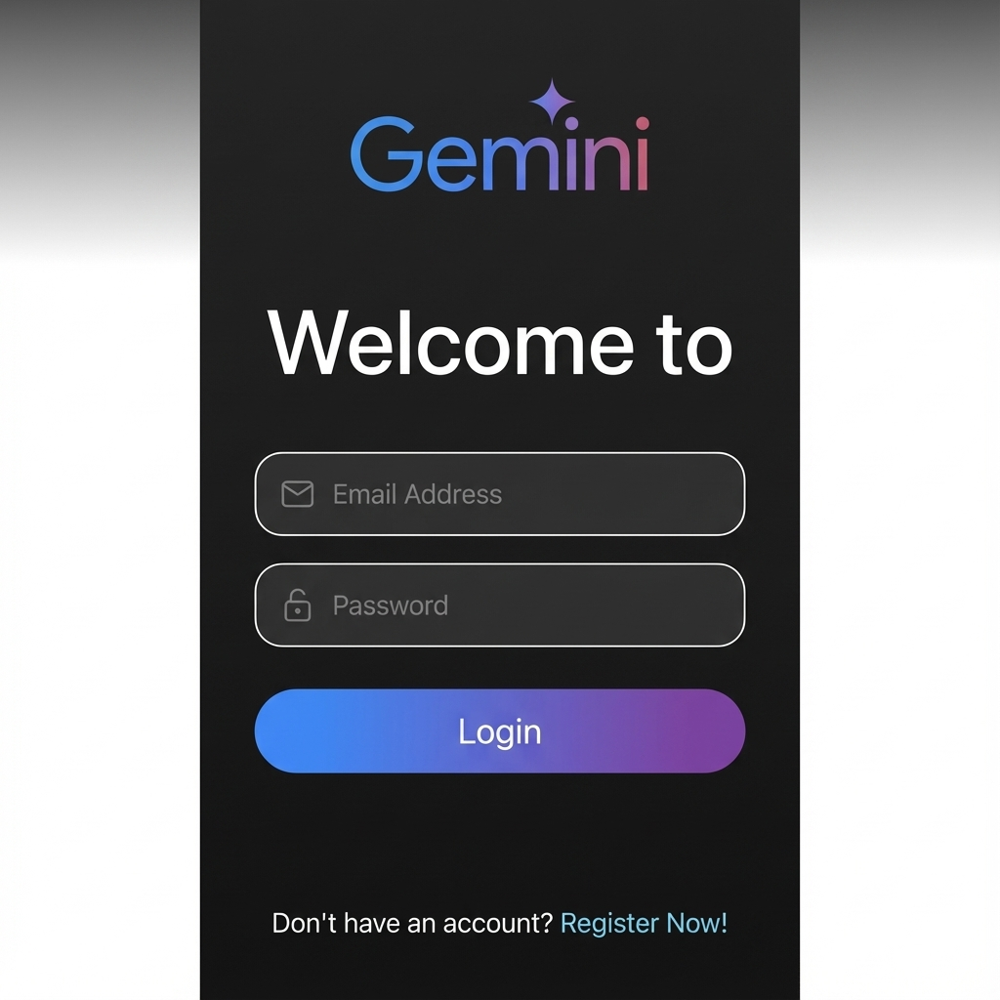
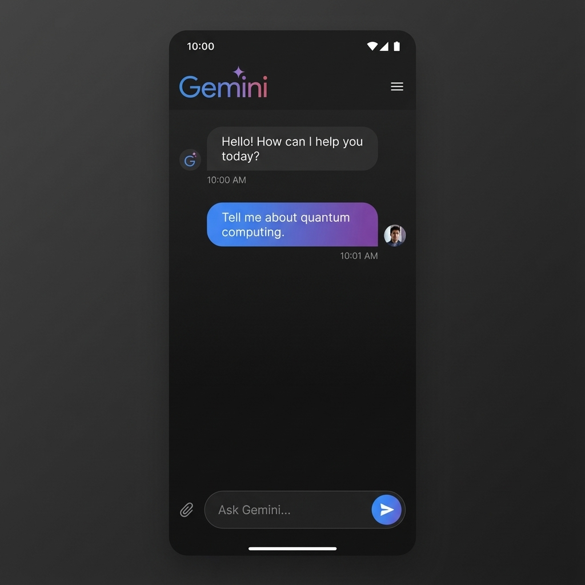
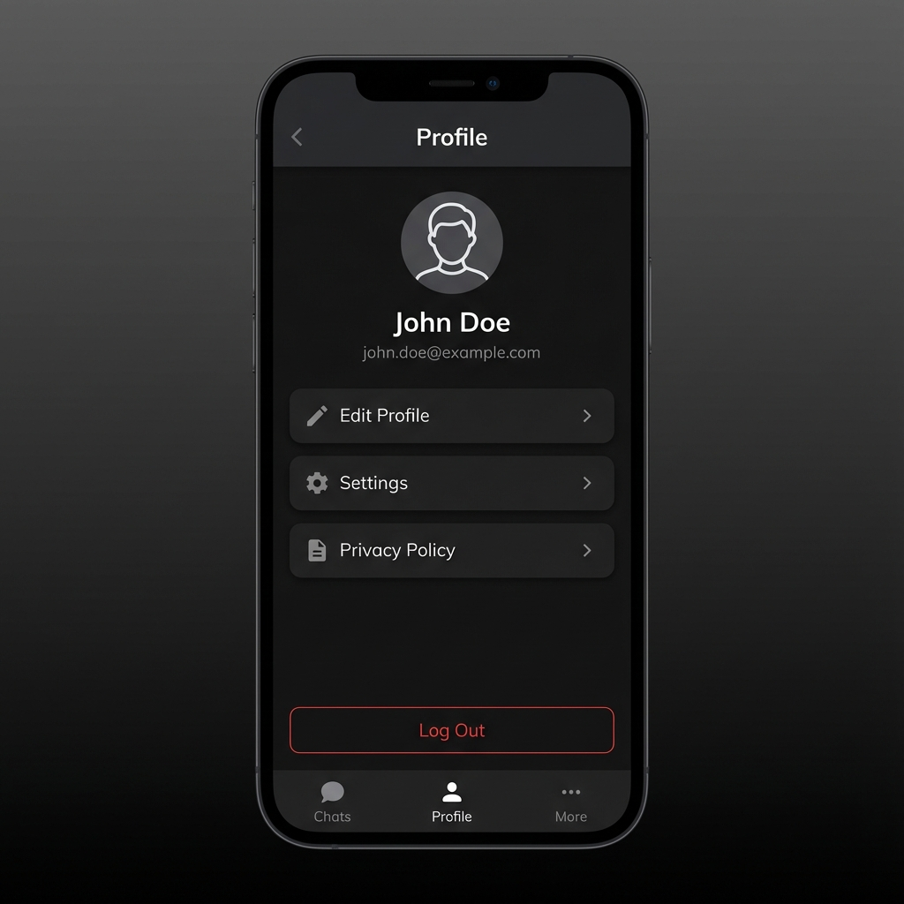

# Chat with Gemini

A Flutter-based chat application that leverages the power of Google's Gemini API to provide intelligent and context-aware conversations.

## Features

* **Real-time Chat:** Engage in seamless and responsive conversations.
* **Powered by Gemini:** Utilizes the advanced capabilities of the Gemini API for natural language understanding and generation.
* **User-friendly Interface:** A clean and intuitive UI for an enjoyable user experience.

## Screenshots

<div style="display: flex; flex-direction: row; gap: 10px; overflow-x: auto;">
  
  
  
  
</div>

## Getting Started

### Prerequisites

* Flutter SDK: [Install Flutter](https://flutter.dev/docs/get-started/install)
* An API key for the Gemini API.

### Installation

1. **Clone the repository:**
   ```bash
   git clone https://github.com/alkahlawy/chat-with-gemini.git
   ```
2. **Install dependencies:**
   ```bash
   flutter pub get
   ```
3. **Run the app:**
   ```bash
   flutter run
   ```

## Project Structure

The project is organized using a clean architecture approach, separating concerns into the following layers:

* **Presentation:** `lib/features/*/presentation` - Contains the UI (widgets, screens) and state management (Bloc).
* **Domain:** `lib/features/*/domain` - Includes the business logic, use cases, and entities.
* **Data:** `lib/features/*/data` - Manages data sources (API, local database) and repositories.
